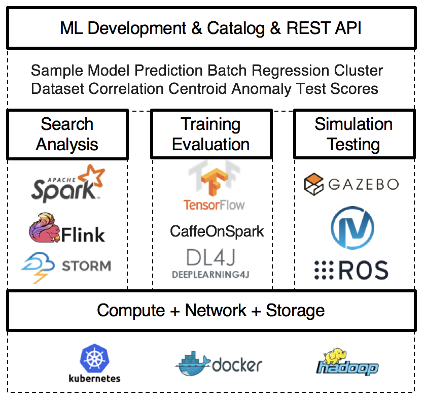
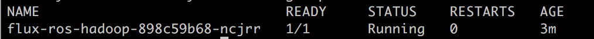
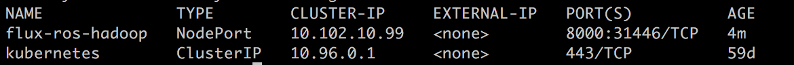
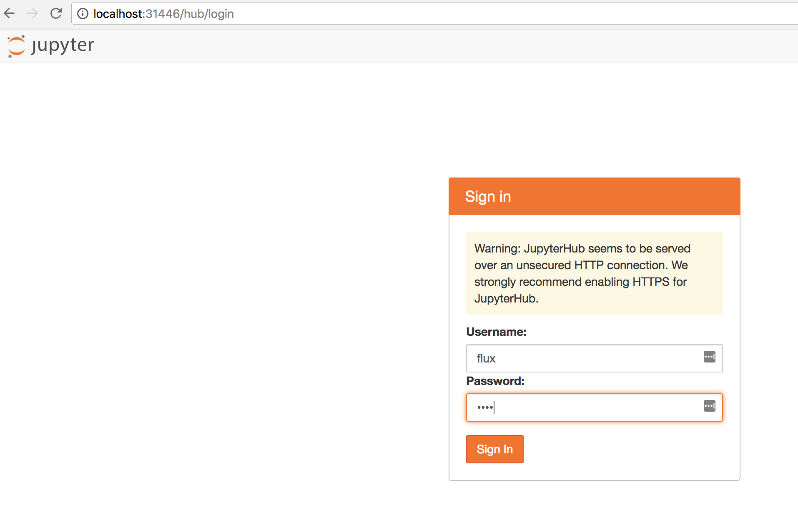
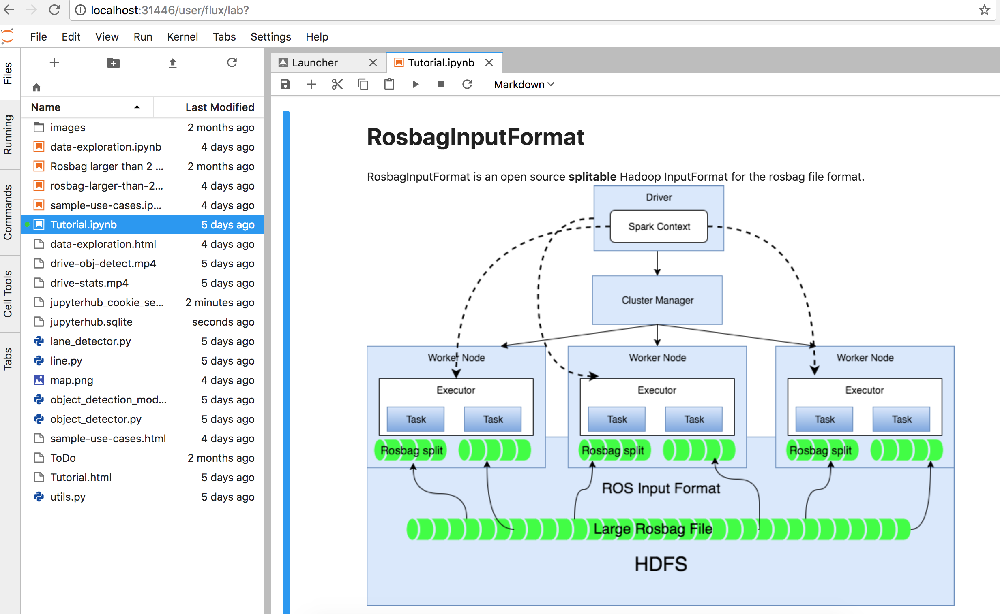

[](https://travis-ci.org/flux-project/flux)

# Flux Project

Autodeploy a complete end-to-end machine/deep learning pipeline on Kubernetes using tools like Spark, TensorFlow, HDFS, etc. - it requires a running Kubernetes (K8s) cluster in the cloud or on-premise.

Please visit the [website for updates.](http://flux-project.org/ "Flux Project")



### Prerequisites
Before installing the components make sure you have installed
* [Docker](https://www.docker.com/get-docker)
  The edge version of docker community edition is coming with a kubernetes option  
* [Kubernetes](https://kubernetes.io/)
* [Helm](https://helm.sh/)
  The package manager for Kubernetes.

### Deploy on nodes (without GPUs)

1. Build the ROS image
   ```bash
   deploy/docker/docker_build_ros.sh
   ```

1. Deploy the image to all nodes or to your configured docker repository

1. Build the base image for Kubernetes deployment
   ```bash
   deploy/docker/docker_build.sh
   ```

1. Create the deployment and the service with Kubernetes
   ```bash
   kubectl create -f deploy/kubernetes/flux-ros-hadoop-deployment.yml
   kubectl create -f deploy/kubernetes/flux-ros-hadoop-service.yml
   ```

1. Check that all components are running
   ```bash
   kubectl get all --all-namespaces
   ```

### Deploy on GPU nodes (alternative)

1. Build the ROS image
   ```bash
   deploy/docker/docker_build_ros_gpu.sh
   ```

1. Deploy the image to all nodes or to your configured docker repository

1. Build the base image for Kubernetes deployment
   ```bash
   deploy/docker/docker_build_gpu.sh
   ```

1. Create the deployment and the service with Kubernetes
   ```bash
   kubectl create -f deploy/kubernetes/flux-ros-hadoop-gpu-deployment.yml
   kubectl create -f deploy/kubernetes/flux-ros-hadoop-gpu-service.yml
   ```

1. Check that all components are running
   ```bash
   kubectl get all --all-namespaces
   ```
   
### Accessing the sample notebooks:

1. Make sure the kubernetes pod is running

   ```bash
   kubectl get pod
   ```
   
   
1. Make sure the kubernetes service is running and note the port for `flux_ros_hadoop` service

   ```bash
   kubectl get service
   ```
   
   
 1. Open the locahost with `flux_ros_hadoop` service port in a browser and login using flux/flux
 
 
 
 
 1. Access the sample notebooks
 
 
  

### Cloud deployment


